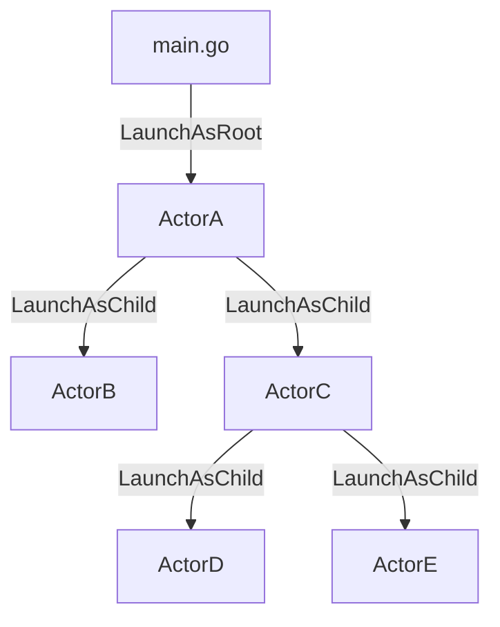

# GoActor

A tree-based actor framework implementation for Golang.

Inspired by

- [Carl Hewitt's actor model](https://www.youtube.com/watch?v=7erJ1DV_Tlo)
- [Alan Kay's Message-Oriented Programming](https://wiki.c2.com/?AlanKayOnMessaging)
- [Bryan Boreham's implementation](https://www.youtube.com/watch?v=yCbon_9yGVs)

this is my attempt to leverage Go's simple concurrency and channel-based messaging.

# Description

The two primary entities in this package are the `Actor` interface and `Base` struct. `Base` implements `Actor`, and needs only be embedded in a user's structs to make them actors. To be active, i.e. to be able to process messages, the actors themselves need to first be 'launched' either by the main application or by other actors.

The main application launches an actor via `LaunchAsRoot` function. Such an actor is a *Root* actor. Any actor can launch another actor via receiver method `LaunchAsChild`. In this case, the former is the *creator* actor; and the latter is the *nested* actor.

### Tree-based messaging

Built with simplicity in mind, an actor can communicate with only its creator and nested actors _it_ creates. The main application always launches the `Root` actor, from which the tree proliferates.

Messages inbound to an actor are defined along with the actor. Messages outbound to a creator, i.e. events, are done via interfaces.
This leaves the creator actor to handle the events (implement the interfaces) as required.

Error and stop propogation are two things done very easily with this kind of messaging.
By default, an error encountered by a nested actor leads to the termination of the actor, and propogation of the error up the tree until the whole tree stops.