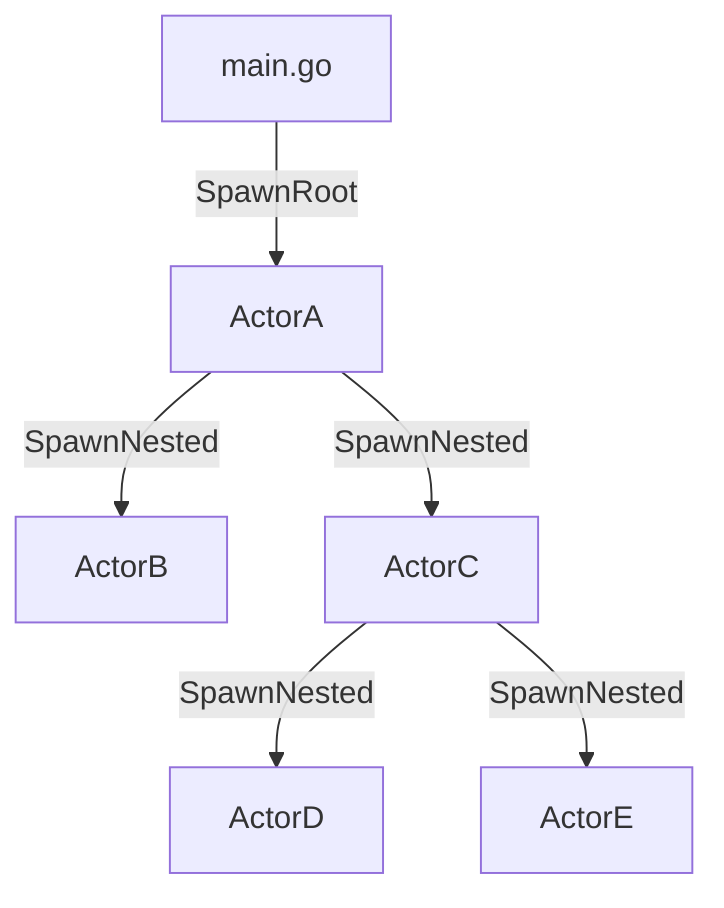

# GoActor

A tree-based actor framework implementation for Golang.

Inspired by

- [Carl Hewitt's actor model](https://www.youtube.com/watch?v=7erJ1DV_Tlo)
- [Alan Kay's Message-Oriented Programming](https://wiki.c2.com/?AlanKayOnMessaging)
- [Bryan Boreham's implementation](https://www.youtube.com/watch?v=yCbon_9yGVs)

this is my attempt to leverage Go's simple concurrency and channel-based messaging.

## Description

The two primary entities in this package are the `Actor` interface and `Base` struct. `Base` implements `Actor`, and needs only be embedded in a user's structs to make them actors. To be active, i.e. to be able to process messages, the actors themselves need to first be 'spawned' either by the main application or by other actors. This spawning process returns an `Inbox`, a kind of mailbox for an actor to receive messages. Two public messages are provided in this package:

| Message | Description |
| --- | --- |
| `SendStopMsg(Inbox)` | Requests the actor identified by `Inbox` to stop. |
| `SendErrorMsg(Inbox, error)` | Reports an `error` to the actor identified by `Inbox`. |

Every spawned actor sequentially processes the received messages in First-In-First-Out order. Therefore, mutexes are not necessary.

The main application spawns an actor via `SpawnRoot` function. Such an actor is a *Root* actor. Any actor can launch another actor via receiver method `SpawnNested`. In this case, the former is the *creator* actor; and the latter is the *nested* actor.

## Tree-based messaging

Built with simplicity in mind, an actor can normally communicate with only its creator and nested actors _it_ creates. The main application always launches the `Root` actor, from which the tree proliferates.



Messages inbound to an actor are to defined along with the actor. Messages outbound to a creator, i.e. events, are done via interfaces.
This leaves the creator actor to handle the events (implement the interfaces) as desired.

Error and stop propogation are two things done very easily with this kind of messaging. By default, an error encountered by a nested actor leads to the termination of the actor, and propogation of the error up the tree until the whole tree stops. This default behavior can be overridden as explained below.

## Sample `main.go` implementation

The snippet below is complete in itself, even though the actor doesn't do anything more than being launched.

```
package main

import (
    "fmt"
	"os"
	"os/signal"
	"syscall"

	actor "gitlab.com/prithvivishak/goactor"
)

type MyActor struct {
    actor.Base
    // Other fields here.
}

func main() {
	osSignal := make(chan os.Signal)
	signal.Notify(osSignal, os.Interrupt, syscall.SIGTERM)

	myactor := new(MyActor) // Initialize however you see fit.
	rootDone, rootInbox, err := actor.SpawnRoot(myactor, "SomeIDHere")
	if err != nil {
		fmt.Println("FATAL: Could not launch the root actor.")
		os.Exit(1)
	}
loop:
	for {
		select {
		case <-rootDone:
			break loop
		case <-osSignal:
			actor.SendStopMsg(rootInbox) // Allow the actor to stop gracefully, which sends above done.
		}
	}
}
```

## Actor API

| Function | Description |
| --- | --- |
| `Inbox() Inbox` | Returns the mailbox of the actor. |
| `CreatorInbox() Inbox` | Returns the mailbox of the actor's creator. |
| `SpawnNested(Actor, string) (Inbox, error)` | Launches an actor as a nested actor, returning its mailbox for custom use.  |
| `Initialize() error` | Use this function to provide your own initialization steps. |
| `IsStopping() bool` | Returns `true` if the actor is in the process of stopping. |
| `Finalize()` | Use this function to finalize whatever was done in `Initialize()`. |
| `HandleError(error) error` | Override this function to provide your own error handling. Default is to propagate the error, hence stop. |
| `HandleLastMsg(Actor, error) error` | Override this function to perform custom actions with the stopped nested actor. |
| `ID() string` | Returns the string used to identify an actor upon launch. |
